# SPL Tokens and NFTs
Solana Web3 Development with Turbin3 Builders

A complete implementation of Solana token operations built with modern TypeScript tooling, featuring custom SPL token mechanics and NFT creation using the Metaplex MPL Core standard.

---

## 📋 Table of Contents
- [Prerequisites & Environment](#prerequisites--environment)
- [Installation & Setup](#installation--setup)
- [Project Scripts & Usage](#project-scripts--usage)
- [Task Implementation Checklist](#task-implementation-checklist)
- [Verification & Testing](#verification--testing)
- [Repository Structure](#repository-structure)
- [Contact](#contact)

---

## 🛠️ Prerequisites & Environment

Ensure you have the following tools installed globally on your machine:
* **Node.js** (v18.x or higher)
* **Solana CLI** (v1.18.x or higher)
* **Solana Devnet Cluster** configured as your default environment

---

## Installation & Setup

1. **Clone the repository:**
   ```bash
   git clone https://github.com/Christone007/Solana_SPL_Tokens_and_NFTs
   cd Solana_SPL_Tokens_and_NFTs
   ```

2. **Install project dependencies:**
   ```bash
   npm install
   ```

3. **Verify Devnet Environment & Funding:**
   Ensure your local keypair is funded with Devnet SOL to pay for transactions:
   ```bash
   solana config set --url devnet
   solana airdrop 2
   ```

4. **Add your devnet Wallet Keypair to the Project Root:**
    Copy your solana devnet wallet keypair json file to the project root and save as `devnet-wallet.json`

---

## 💡 Project Scripts & Usage

Run the scripts in sequential order to complete the pipeline:

### 1. SPL Token Workflow
```bash
# 1. Initialize the Mint Account
npm run spl:init

# 2. Add metadata to your SPL token
npm run spl:metadata

# 3. Mint tokens to your token account
npm run spl:mint

# 4. Transfer the SPL tokens to a recipient wallet
npm run spl:transfer
```

### 2. MPL Core NFT Workflow
```bash
# 1. Upload/Prepare the NFT asset image
npm run nft:image

# 2. Generate and prepare the metadata URI
npm run nft:metadata

# 3. Mint the MPL Core NFT & update as the authority
npm run nft:mint

# 4. Update the NFT metadata
npm run nft:update

# 5. Transfer the NFT to another wallet
npm run nft:transfer

# 6. Burn the NFT
npm run nft:burn 
```

---

## Task Implementation Checklist

### Core Tasks
- [ ] **1. Mint and Transfer your own SPL Token**
  - Generated a unique mint address using `@solana-program/token` and initialized a mint account.
    * *Mint address:* `E9hEjM9x1qgVRXETtzTBVEkc6pFhDqhQfWkHspWjcgBo` 
    * *Transaction ID* [4MPR1oFNXLz7YAE5tQYUZ6Ct7ne7pL2cQCZDA7AGVnz5rcgRFRy3ku7pZYZzVdr4eYaYXjfj5Ehdzf2v9W7aZ8EC](https://solscan.io/tx/4MPR1oFNXLz7YAE5tQYUZ6Ct7ne7pL2cQCZDA7AGVnz5rcgRFRy3ku7pZYZzVdr4eYaYXjfj5Ehdzf2v9W7aZ8EC?cluster=devnet)

  - Created a Metadata account on the mint address with Token name and image
    * *Transaction ID* [2VQa6zmi5pDq58kDPs5KKM5jrVvUNsaaQmBgz49XD4D6a3B4g2fQW9guz6wVP5jcg7yFc7QEBX6RF5pEM8pNEx92](https://solscan.io/tx/2VQa6zmi5pDq58kDPs5KKM5jrVvUNsaaQmBgz49XD4D6a3B4g2fQW9guz6wVP5jcg7yFc7QEBX6RF5pEM8pNEx92?cluster=devnet)

  - Initialized a token account and minted a fixed supply of 400 Tokens.
    * *mint txid:* [5Xoxe23HPnnHg4waqfpxg6vr1qTcyMbYn4TZs7dg4QrRfqRdrMkJKvRGS6KJHeGFDAFWFkNggb6k2cchxNw1Eswv](https://solscan.io/tx/5Xoxe23HPnnHg4waqfpxg6vr1qTcyMbYn4TZs7dg4QrRfqRdrMkJKvRGS6KJHeGFDAFWFkNggb6k2cchxNw1Eswv?cluster=devnet)

  - Successfully transferred a portion of the tokens to a recipient wallet.
    * *Txid:* [4zNgnTsC16SGCioPHZ7B6iPED4pmd4gQv4tyjMrVWZ2yiP8jrixL4M9S5tAQAVjy9yzGtkCiaWZmojwnC5JurUKg](https://solscan.io/tx/4zNgnTsC16SGCioPHZ7B6iPED4pmd4gQv4tyjMrVWZ2yiP8jrixL4M9S5tAQAVjy9yzGtkCiaWZmojwnC5JurUKg?cluster=devnet)


- [ ] **2. Mint an NFT using MPL Core**
  - Created a lightweight Metaplex MPL Core Asset via `@metaplex-foundation/mpl-core`.
  - Integrated off-chain metadata using Umi and Irys.
    * *Tx signature:* [22Yorz96A21qPPRjasVs1kyoDdSKMr9RWhXeGHQAYxDmf2uPW1VLVWPRJwtW7ASrR9cRYzm5DdD9XxU8ZHREKM88](https://solscan.io/tx/22Yorz96A21qPPRjasVs1kyoDdSKMr9RWhXeGHQAYxDmf2uPW1VLVWPRJwtW7ASrR9cRYzm5DdD9XxU8ZHREKM88?cluster=devnet)
    * *Asset Address:* `B1zeQGnmLgmKA6wc1mKTDkwNoeZ2xNDrw6ZqZiL8o1h5`

- [ ] **3. Update the NFT's Name and Metadata**
  - Executed a metadata update transaction using the authorized update authority.
  - Successfully mutated the asset name and properties on-chain.
    * *Update TX ID:* [CFfMcPpq3qbVCyVv5V2JK5DBH9eJB2o8ABYiaVdssoLLUzbmdsn8rxmnAnEhWsRKQLbEqrMDVh7ry5WQyEUpvuX](https://solscan.io/tx/CFfMcPpq3qbVCyVv5V2JK5DBH9eJB2o8ABYiaVdssoLLUzbmdsn8rxmnAnEhWsRKQLbEqrMDVh7ry5WQyEUpvuX?cluster=devnet)

- [ ] **4. Transfer the NFT to a new Wallet**
  - Successfully transferred the NFT to a new wallet
    * *Transfer Tx ID:* [8HMHDVoZTbPyucjnJ9AJhiDd9Wyj6JxdK6LE2vvPdhoFdxmL6Jyhm1oDhQ4QP4xezp62yGoTQPLgpNQEny87Kwe](https://solscan.io/tx/8HMHDVoZTbPyucjnJ9AJhiDd9Wyj6JxdK6LE2vvPdhoFdxmL6Jyhm1oDhQ4QP4xezp62yGoTQPLgpNQEny87Kwe?cluster=devnet)

- [ ] **5. Burn the NFT**
  - Only the NFT owner can destroy the NFT, hence the new Owner was asked to transfer back the NFT
    * *Burn Tx ID:* [nTTzxkxMocPkubQiShVZSEWoiK9Zu28oqDcaLrvQsLcR5eh3A7w3zdQv1t89CeDTsia9865NUJGZU1di2JjHd35](https://solscan.io/tx/nTTzxkxMocPkubQiShVZSEWoiK9Zu28oqDcaLrvQsLcR5eh3A7w3zdQv1t89CeDTsia9865NUJGZU1di2JjHd35?cluster=devnet)


---

## 📊 Verification & Testing

All execution scripts output verification logs directly to the console once instructions are written to the block.

### Execution & Outputs Screenshot
Below are mandatory screenshots proving the scripts execute correctly and transactions successfully commit to the cluster:

- [ ] **spl_init:**
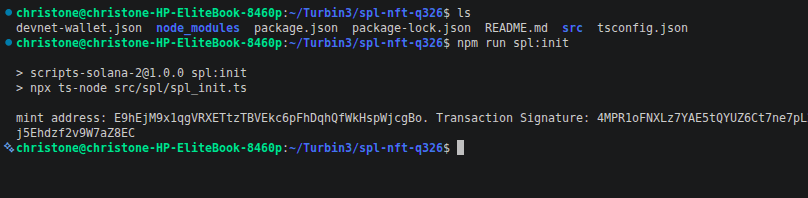

- [ ] **spl_metadata:**
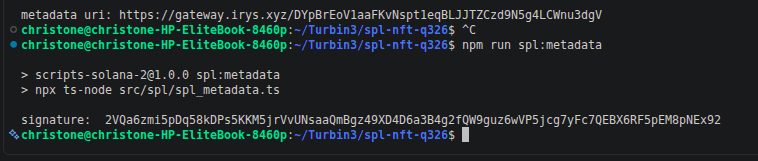

- [ ] **spl_mint:**
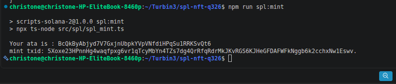
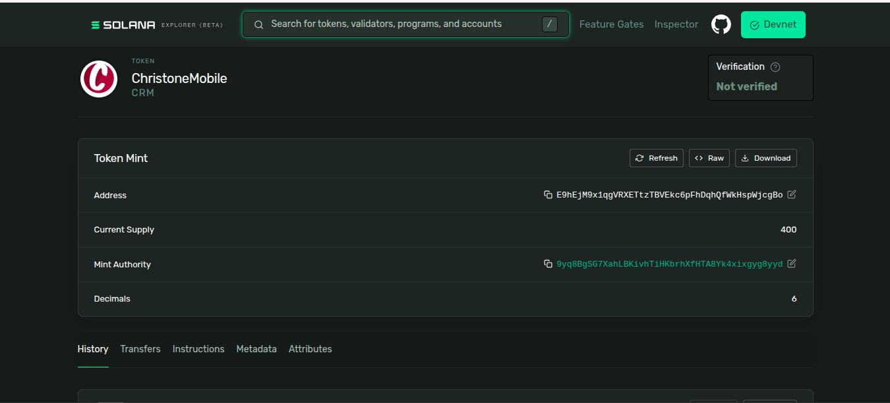

- [ ] **spl_transfer:**
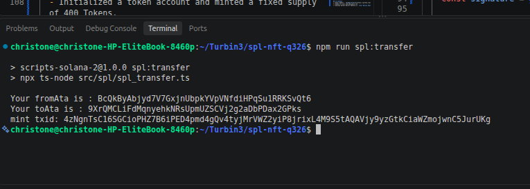

- [ ] **nft_mint:**
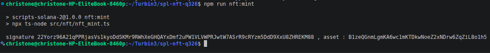


- [ ] **nft_update:**
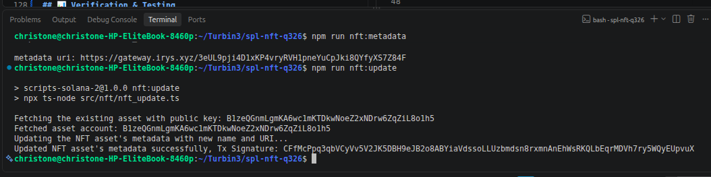

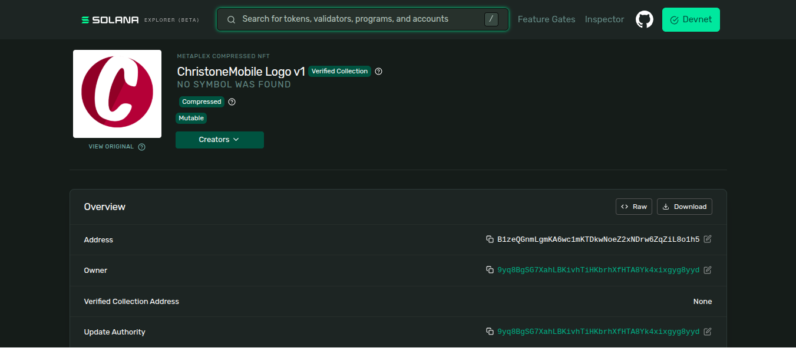

- [ ] **nft_transfer:**
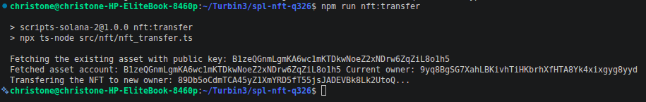

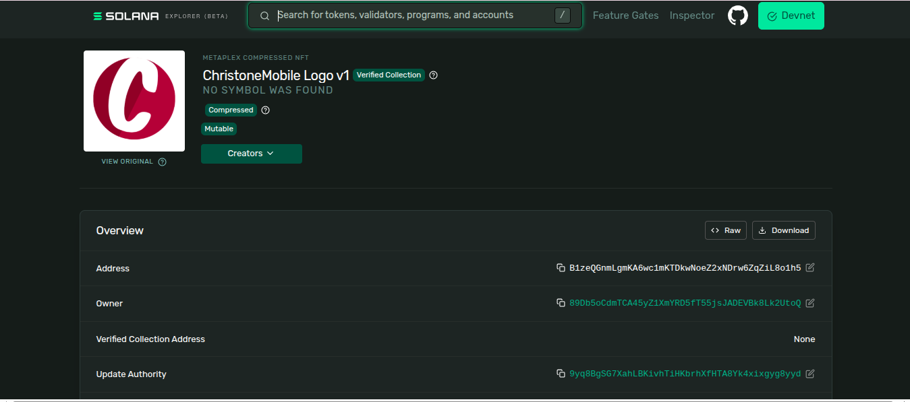

- [ ] **nft_burn:**
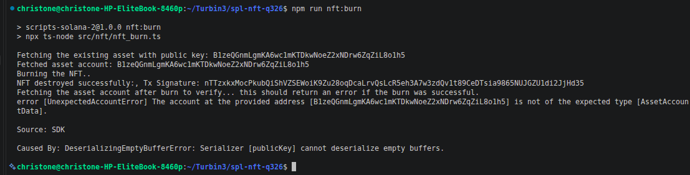

---

## 🗒️ Repository Structure

```text
├── src/
│   ├── spl/
│   │   ├── spl_init.ts      # Initializes the Mint configuration
│   │   ├── spl_metadata.ts  # Adds metadata pointers to the token
│   │   ├── spl_mint.ts      # Mints SPL tokens to target account
│   │   └── spl_transfer.ts  # Handles the token recipient transfers
│   └── nft/
│       ├── nft_image.ts     # Prepares / uploads assets
│       ├── nft_metadata.ts  # Prepares JSON metadata 
│       ├── nft_mint.ts  # Mints and updates the MPL
│       ├── nft_update.ts  # Updates the NFT name and descr
│       ├── nft_transfer.ts  # Transfers the NFT
│       └── nft_burn.ts      # Murns the NFT 
├── package.json
├── screenshots/
└── README.md
```

---

## 📫 Contact
* **Nwaburu Emeka Christian** - [GitHub Profile](https://github.com/Christone007)
* **Email:** exellentemy@gmail.com
* **Solana Devnet Wallet Address:** `9yq8BgSG7XahLBKivhTiHKbrhXfHTA8Yk4xixgyg8yyd`
